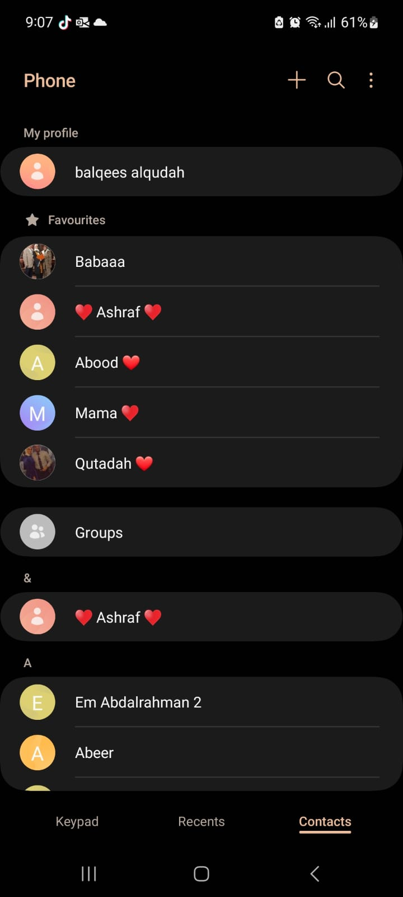

# RecyclerViews

A RecyclerView is a user interface component used in Android applications to efficiently display lists or grids of
items, such as in a contact list, news feed, or a gallery of images. It's a programming construct to manage the display
of dynamic data within an Android app.

1. What makes a RecyclerView dynamic?
   A RecyclerView is made dynamic through several key components and features that allow it to efficiently handle
   and display dynamic data in Android applications. These include:
    - Adapter: Responsible for creating, binding, and updating views for each item in the dataset.
    - LayoutManager: Responsible for arranging and positioning items on the screen.
    - Click Listeners: To handle user interactions with individual items.
    - Pagination: Loading data in chunks for large datasets.
    - NotifyDataSetChanged: Methods to notify the adapter when the dataset changes, enabling the RecyclerView to
      reflect those changes.

2. Share a screenshot of a recycler view in an application you use!
   My contact List
   

## Things I want to know more about
   - RecyclerView.Adapter: Understand how to create a custom adapter for my RecyclerView
   - LayoutManagers: Learn about different layout managers available for RecyclerView, such as LinearLayoutManager,
     and GridLayoutManager, since each one serves different purposes. 